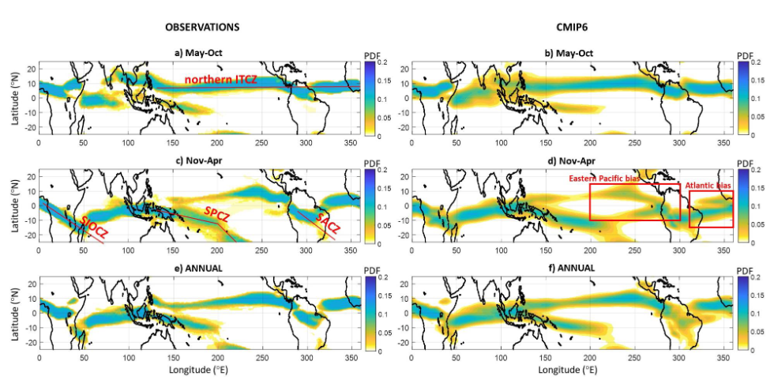

# Representation of Convergence Zones in km-scale model runs (hk25-AusNode-TConvZones)  




The biases in the representation of tropical rainfall patterns, particularly arising from systematic biases in tropical convergence zones, have been a long-standing aspect across generations of climate models. Two major biases are the Double ITCZ bias and the baises in the meridional extent of the seasonal cycle of the ITCZ as well as the location of other major convergence zones. These biases have been shown to be associated with rainfall drizzling biases in AMIP and CMIP models, as well as biases associated with deep/strong convection and air circulation patterns. Through this project we will attempt to unravel the representation of convergence zones and associated tropical rainfall patterns in the tropics in km-scale model runs and we will examine the potential source of existing biases/improvements in biases in comparison to CMIP/AMIP models and observations. Here are the main research questions we are trying to address:

Primary research question:

- How well do high resolution “km-scale” storm-resolving models simulate the Tropical Convergence Zones and its seasonal cycle over different ocean basins, and what are the reasons for these improvements?


Secondary research questions:

- If the double ITCZ bias is reduced in the “km-scale” model runs, then are the improvements related to the improvements in drizzling bias in these models?

- Are the improvements in the seasonal cycle of the ITCZ related to improved representation of winds and seasonality of wind-reversal associated with major monsoon systems in the tropics?

- Are other major convergence zones, such as the SPCZ, SACZ, etc. in the tropics (shown in Figure 2), better represented in the “km-scale” model runs?


See [Project Description](https://docs.google.com/document/d/1Wnfcz910Y70zxq7FoX4tmrN5GaVDoJqZLpqCGmr1B1E/edit?tab=t.crl7ck8oqyr2) for more details.


**Project leads:** 

Aditya Sengupta, University of Melbourne (@adisen99)

**Project members:** 

Sibyl Cheng, University of New South Wales (@sibylcheng), 

Sreyasi Biswas, Indian Institute of Technology, Bombay

**Collaborators:** 

Nicola Maher, The Australian National University (@nicolamaher)


## Data

Variables from the km-scale atmosphere only model run: 

- Precipitation rate/accumulated rainfall totals, 
- Low-level cloud fraction (LLC; if available), 
- ToA radiative fluxes;
- Wind at different pressure levels;
-  Surface specific humidity. 
- Total column water vapour (TCWV)

Same variables required from CMIP6/AMIP6 models accessed through NCI

In addition, we will require access to observation datasets for 

- precipitation (GPM-IMERG or GPCP or TRMM); 
- CERES dataset for ToA radiative fluxes;
- cloud fraction data from CALIPSO;
- Wind speed data from reanalysis datasets (20CR or ERA5)
- Observation or reanalysis TCWV


## Contributing Guidelines

> The group will decide how to work as a team. This is only an example. 

This section outlines the guidelines to ensure everyone can work and collaborate. All project members have write access to this repository, to avoid overlapping and merge issues make sure you discuss the plan and any changes to existing code or analysis.

### Project organisation

All tasks and activities will be managed through GitHub Issues. While most discussions will take place face-to-face, it is important to document the main ideas and decisions on an issue. Issues will be assigned to one or more people and classified using labels. If you want to work on an issue, comment and make sure is assigned to you to avoid overlapping. If you find a problem in the code or a new task, you can open an issue. 

### How to collaborate

* **Main branch:** We want to keep things simple, if you are working on a notebook alone you can push changes to the main branch. Make sure to 1) only add and ccommit that file and nothing else, 2) pull from the remote repo and 3) push.

* **Working on a branch:** if you want to fix or propose a change to someone else code you will need to create a branch and open a pull request. Make sure you explain your suggestion in the pull request message. **This also applies to collaborators outside the project team.**

### Repository structure

This is how the project should look like but make sure to change the name `template-hackathon-project` to something meaningful. 

```bash
template-hackathon-project/
├── LICENCE
├── README.md
├── template_project_hackathon
│   ├── analysis.py
│   ├── __init__.py
│   └── read.py
└── tests
    ├── test_analysis.py
    └── test_read.py
```
* `template_hackathon_project/` this folder will include the code to analysis the data.
* `tests/` this folder contains test code that verifies that your code does what it should.

